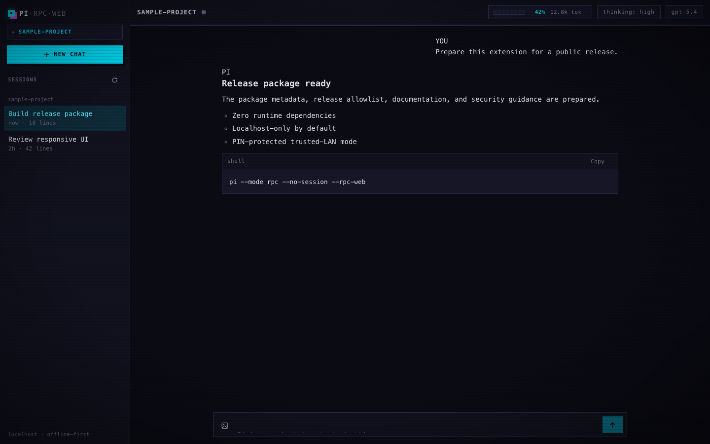

# pi-rpc-web

A [pi](https://github.com/earendil-works/pi-coding-agent) extension that
serves a beautiful web UI for the pi coding agent on **localhost** by default,
with an optional trusted-LAN mode protected by a six-digit PIN.

Zero runtime npm dependencies: Node built-ins only on the server (including a
hand-rolled RFC 6455 WebSocket implementation), vanilla JS/CSS with no build
step in the browser.

## Usage

Headless mode is the **only** supported launch.

Localhost remains the default and stays **unauthenticated** because only the
host machine can reach `127.0.0.1`:

```sh
pi --mode rpc --no-session --rpc-web
```

Trusted-LAN access requires **both** flags:

```sh
pi --mode rpc --no-session --rpc-web --rpc-web-lan
```

- `--rpc-web` alone serves the web UI on `$PI_WEB_PORT` or 7690, binding
  **127.0.0.1 only** (an ephemeral port is used if the port is taken).
- `--rpc-web --rpc-web-lan` binds IPv4 **0.0.0.0 only**, exposes the UI to your
  local network, and requires PIN login before any protected HTTP page or
  WebSocket bridge is available.
- Startup details go to **stderr**, never stdout, so the outer host keeps a
  valid JSONL RPC stream.
- The server is session-scoped and shuts down when the session ends
  (`SIGTERM` and `SIGINT` both stop it cleanly).

Representative stderr output:

```text
pi-rpc-web serving at http://127.0.0.1:7690
```

```text
pi-rpc-web LAN server:
  http://192.168.1.233:7690
Login PIN: 123 456
```

In LAN mode:

- the six-digit PIN is reusable until the pi host process restarts;
- the PIN is never placed in URLs or persisted;
- successful login sets a memory-only `pi_rpc_web_session` cookie with
  `HttpOnly; SameSite=Strict; Path=/` and no persistent expiry;
- refreshes and new tabs in the same browser profile reuse that cookie
  automatically;
- restarting pi invalidates every PIN-derived browser session.

The cookie intentionally does **not** use `Secure`: LAN mode is plain HTTP on
trusted local networks, and browsers would not send a `Secure` cookie over that
HTTP connection.

### Environment variables

| Variable      | Purpose                                  |
| ------------- | ---------------------------------------- |
| `PI_WEB_PORT` | Server port (`0` selects an ephemeral port; default `7690`) |
| `PI_BIN`      | Path to the pi binary spawned per browser tab |

## Sessions and tabs

- Each browser tab opens sessions from the sidebar; every switch terminates
  the current agent child and **cold-resumes** into the target via a fresh
  `pi --mode rpc` child with the target session.
- The same session may be opened by **multiple tabs at once**: each tab gets
  its own independent RPC child. No writer lease is enforced — concurrent
  writes to one session are **not reconciled**; last writer wins on disk.
- Browser session navigation never sends `switch_session` into a running
  child; children are always spawned fresh against the chosen session.

## Features

- **Full RPC bridge** — each browser connection lazily spawns its own
  `pi --mode rpc --no-session` child process; prompts, streaming deltas,
  tool-execution cards, queue updates, model switching, thinking levels,
  session stats
- **Sessions sidebar** — lists recent sessions per project, open any session
  cold-resumed in place, open in a new tab, rename, delete, manage projects
  (hide / bulk-delete)
- **Slash-command autocomplete** fed by `get_commands`
- **Extension UI passthrough** — `select`/`confirm`/`input`/`editor` dialogs,
  toasts for `notify`, status/title/widget updates rendered in the browser
- **Streaming UX** — live markdown rendering, collapsible thinking blocks,
  auto-scroll with "jump to latest", steer/follow-up chips while busy,
  image attachments (paste or file picker)
- **Image normalization** — uploads are verified and converted to JPEG;
  macOS can additionally normalize HEIC and other formats through
  `/usr/bin/sips`. On other platforms, select an image the browser can decode
  as JPEG, PNG, GIF, or WebP.
- **Resilient** — reconnects with backoff, respawns the pi child on demand
  after exit

## Install

From npm:

```sh
pi install npm:pi-rpc-web
```

Or directly from GitHub:

```sh
pi install git:github.com/tohlh/pi-rpc-web
```

Then launch the localhost server:

```sh
pi --mode rpc --no-session --rpc-web
```

Or manually, copy/symlink this directory into your extensions folder:

```sh
ln -s /path/to/pi-rpc-web ~/.pi/agent/extensions/pi-rpc-web
```

For a quick trial without installing:

```sh
pi -e /path/to/pi-rpc-web/src/extension.ts   # without the web server
pi --mode rpc --no-session --rpc-web -e /path/to/pi-rpc-web/src/extension.ts
pi --mode rpc --no-session --rpc-web --rpc-web-lan -e /path/to/pi-rpc-web/src/extension.ts
```

## Security

- Localhost mode binds **127.0.0.1 only** and is intended for local use on the
  host machine.
- LAN mode is plain **HTTP** and is suitable only for **trusted local
  networks**.
- **Do not** port-forward LAN mode to the public internet.
- Anyone who can reach the port can try the login flow and, once authorized,
  gains full control of the agent running with your permissions.
- For untrusted-network access, use **SSH tunneling** or **Tailscale** instead
  of exposing the port directly.
- Child RPC processes never inherit or accept `--rpc-web` or `--rpc-web-lan`:
  recursive spawning of the browser host is rejected outright.

## Disclaimer

This project was entirely vibe coded. It is provided **as is**, without any
warranty or guarantee of reliability, security, or fitness for a particular
purpose. Review the source before installing it, back up important projects and
session files, and use it at your own risk. The maintainer accepts no
responsibility for breakage, data loss, security incidents, or other damages
arising from its use.

## Architecture

```text
browser ⇄ HTTP/WebSocket + optional LAN PIN gate ⇄ src/server.ts ⇄ src/bridge.ts ⇄ `pi --mode rpc`
                                                         ⇅
                                                     ui/ static files
```

- **`src/ws.ts`** — dependency-free RFC 6455 server WebSocket: SHA-1 handshake,
  masked-client-frame validation, fragmentation, ping/pong, close handshake,
  2 MB message cap.
- **`src/server.ts`** — HTTP static file serving (path-traversal safe), public
  `/login` handling in LAN mode, protected-route redirects, and a WebSocket
  endpoint on any path.
- **`src/bridge.ts`** — one child process per socket, strict JSONL framing
  (`\n`-only records, `\r` stripped, UTF-8 chunk-safe via `StringDecoder`),
  verbatim passthrough both ways, `sessions.list` / `ping` meta actions,
  lazy respawn, graceful kill (SIGTERM → SIGKILL after 3 s) on disconnect.
- **`src/extension.ts`** — registers `--rpc-web` and `--rpc-web-lan`, starts the
  server on `session_start` in rpc mode (URL/PIN → stderr), stops it on
  `session_shutdown`.

See `CONTRACT.md` for the full WebSocket and LAN-auth protocol contract.

## Development

```sh
npm run typecheck   # tsc --noEmit (requires devDependency types)
npm test            # ws, LAN auth, server auth, e2e, RPC-web lifecycle, localhost/LAN smoke
```

Tests need Node ≥ 22.18 (unflagged TypeScript type stripping). The e2e suite
spawns a real `pi --mode rpc`; LLM-dependent assertions are skipped unless
`PI_RPC_WEB_E2E_LLM=1`.

## Preview


